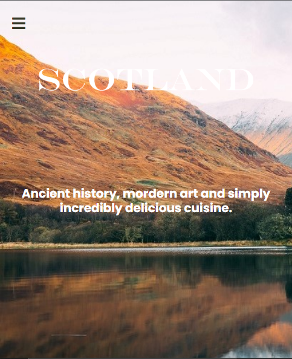

# scotland-adventures
This is a story telling web application that provides a platform for story tellers who want to share and document their adventures about several locations in Scotland, to post stories which may include text, photos, and multimedia about their experience.

## Built With

- HTML5, Javascript
- CSS3
- Webpack

## Live Demo

[Live Demo Link](https://vickymarz.github.io/scotland-adventures/dist/)

## Getting Started

To get a local copy up and running follow these simple example steps.

## Prerequisites

- Have a good knowledge on how to parse UI designs
- Have VSCode or other text editor installed. [Link to download VSCode](https://code.visualstudio.com/download)
- Install node package. [Link to download node](https://nodejs.org/en/download/)
- Have git installed.[Link to download git](https://git-scm.com/downloads)
- Create a github repository.

## Setup

- git clone https://github.com/vickymarz/scotland-adventures.git
- cd scotland-adventures/
- Setup webpack configuration to bundle up your javascript modules. Follow the instructions from the [getting started guide](https://webpack.js.org/guides/getting-started/#basic-setup) to set up the basics

## Deployment

- Use GitHub pages to deploy website
- For more information about publishing sources, see [About github pages](https://pages.github.com/)

## Author

👤 **Okoroji Victor aka Vickymarz**

- GitHub: [@githubhandle](https://github.com/vickymarz)

- LinkedIn: [LinkedIn](https://www.linkedin.com/in/okoroji-victor-ebube-8791741a0)

## 🤝 Contributing

Contributions, issues, and feature requests are welcome!

Feel free to check the [issues page](../../issues/).

## Show your support

Give a ⭐️ if you like this project!

## Acknowledgments

- Emmanuel Orji
- Felicia

